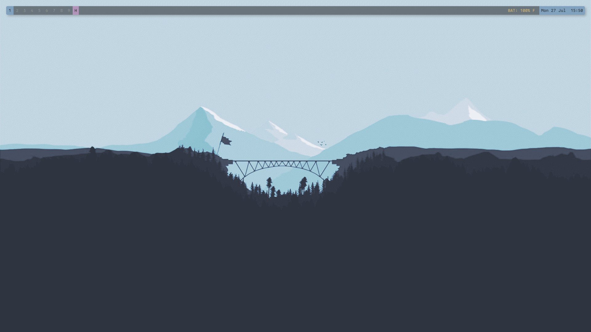
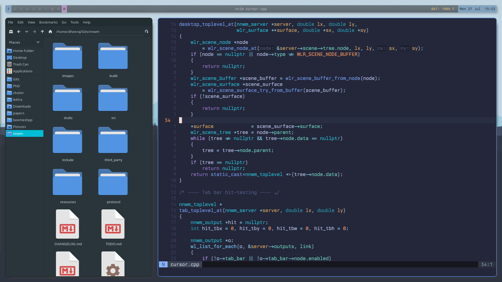
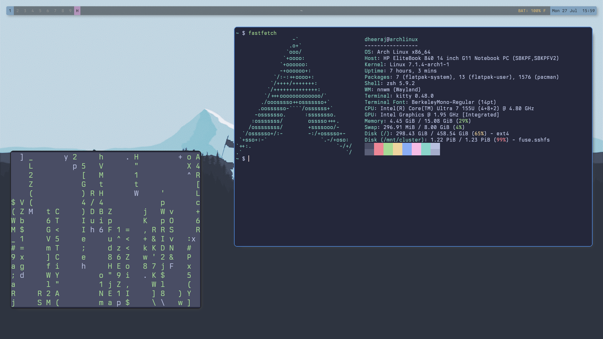

<p align="center">

</p>

**NNWM (No Name Window Manager)** is a tiling Wayland compositor built on [wlroots](https://gitlab.freedesktop.org/wlroots/wlroots) with Lua configuration support.

Latest Version: 0.1.4

## Why ?

Because [**MangoWM**](https://github.com/mangowm/mango) community downvoted my lua configuration support [request](https://github.com/mangowm/mango/issues/1072), I decided to make my own tiling Wayland compositor with Lua configuration and hot-reload support.

P.S : MangoWM is awesome, and I love it, but I want to have my own compositor with Lua configuration support.

## Features

- Lua configuration with hot-reload
- Master-stack, tabbed, and scrolling layouts with per-workspace master ratio
- Multi-monitor support with per-output workspace, layout configurations
- Floating, fullscreen, fake-fullscreen, maximized, and sticky windows
- Window rules
- NNWM panel
- Overview mode - a zoomed-out view of all workspaces and windows
- Configurable hot-corners - trigger actions when the mouse is moved to a corner of the screen
- Animations and effects (requires sceneFX)
    - **Window open/close** — `"fade_scale"` (default), `"fade"`, `"scale"`, `"slide_up/down/left/right"`, `"none"`
    - **Layout transitions** — smooth position and size tweening
    - **Workspace switch** — slide or fade between workspaces
    - **Focus border crossfade** — border color blends on focus change
    - **Easing curves** — `"ease_out"` (default), `"ease_in"`, `"ease_in_out"`, `"linear"`, `"bounce"`, `"elastic"`
    - Per-window overrides via `nnwm.rule()`: `anim_open`, `anim_close`, `no_anim`
- Advanced
    - Event hooks react to nnwm manager events
    - Introspection API - query live compositor state from Lua
- `nnwmctl` - a command-line utility to control nnwm from scripts or other programs

## Dependencies

- wlroots 0.19 (or 0.20 when building with sceneFX)
- wayland-server
- xkbcommon
- libinput
- pixman
- cairo + pango (titlebars and error overlay)
- Lua 5.4

## Building

```sh
cmake -B build
cmake --build build --config release
```

### Animations and Bling (sceneFX) \[Optional, Experimental\]

> To enable sceneFX effects and animations:

nnwm optionally integrates with [sceneFX](https://github.com/wlrfx/scenefx), a drop-in wlroots scene-graph replacement that adds GPU-accelerated visual effects. This is **entirely optional** — nnwm builds and runs without it out of the box.

> **Experimental:** sceneFX support is still experimental. It requires wlroots 0.20 and may not be stable on all hardware or driver combinations.

### Building with sceneFX

```sh
cmake -B build -DUSE_SCENEFX=ON
cmake --build build
```

## Installation

```sh
sudo cmake --install build
```

This installs the `nnwm` binary to `/usr/local/bin/` and the `nnwm.desktop` session file to `/usr/local/share/wayland-sessions/`, making nnwm appear in the session list of login managers (GDM, SDDM, LightDM, etc.).

To install under `/usr` instead:

```sh
sudo cmake --install build --prefix /usr
```

## Usage

```sh
nnwm          # auto-selects backend (DRM/KMS when run from TTY)
nnwm -c ~/.config/nnwm/init.lua
nnwm -s "kitty &"   # run a command after startup
```

## Configuration

- [CONFIGURATION](./CONFIGURATION.md) - TODO (For now see `example-config.lua`)

## Screenshots

- 
- 
- 

## Links

- [CHANGELOG](./CHANGELOG.md)
- [TODO](./TODO.md)
